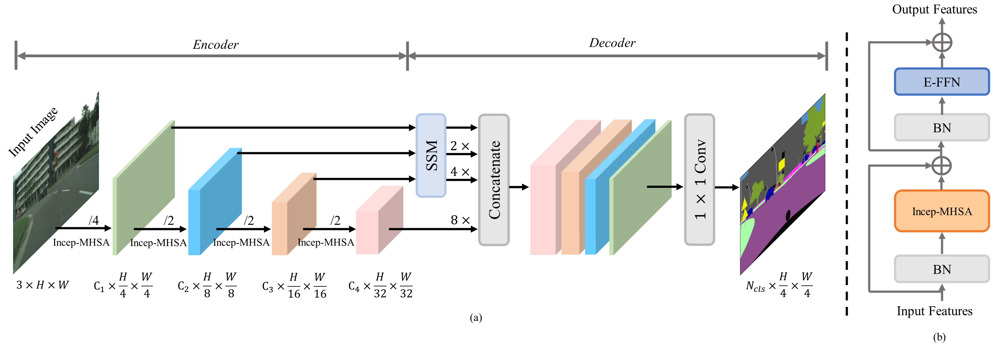

updating....
# IncepFormer: Efficient Inception Transformer with Spatial Selection Decoder for Semantic Segmentation

<!--  -->
<div align="center">
  
</div>
<p align="center">
  
</p>

<!-- ### [Project page](https://github.com/shendu0321/IncepFormer) | [Paper](http://arxiv.org/abs/2212.03035)

IncepFormer: Efficient Inception Transformer with Pyramid Pooling for Semantic Segmentation.<br>
Lihua Fu, Haoyue Tian, Xiangping Bryce Zhai, Pan Gao, Xiaojiang Peng

This repository contains the official Pytorch implementation of training & evaluation code and the pretrained models for [IncepFormer](http://arxiv.org/abs/2212.03035). -->


We use [MMSegmentation v0.29.0](https://github.com/open-mmlab/mmsegmentation/tree/v0.29.0) as the codebase.


## Installation

For install and data preparation, please refer to the guidelines in [MMSegmentation v0.29.0](https://github.com/open-mmlab/mmsegmentation/tree/v0.29.0).

Other requirements:
```pip install timm==0.4.12```

An example (works for me): ```CUDA 11.0``` and  ```pytorch 1.7.0``` 

```
pip install torchvision==0.8.0
pip install timm==0.4.12
pip install mmcv-full==1.5.3 
pip install opencv-python==4.6.0.66
cd IncepFormer && pip install -e .
```

## Training

Download `weights` 
(
[google drive](https://drive.google.com/drive/folders/1EbmtUFy8WjYoeTEf2qG1sdOYYyVLtKm_?usp=sharing)
) 
pretrained on ImageNet-1K, and put them in a folder ```pretrained/```.

Example: train ```IncepFormer-T``` on ```ADE20K```:

```
# Single-gpu training
python tools/train.py local_configs/incepformer/Tiny/tiny_ade_512×512_160k.py

# Multi-gpu training
./tools/dist_train.sh local_configs/incepformer/Tiny/tiny_ade_512×512_160k.py <GPU_NUM>
```

## Evaluation

Example: evaluate ```IncepFormer-T``` on ```ADE20K```:

```
# Single-gpu testing
python tools/test.py local_configs/incepformer/Tiny/tiny_ade_512×512_160k.py /path/to/checkpoint_file

# Multi-gpu testing
./tools/dist_test.sh local_configs/incepformer/Tiny/tiny_ade_512×512_160k.py /path/to/checkpoint_file <GPU_NUM>

# Multi-gpu, multi-scale testing
tools/dist_test.sh local_configs/incepformer/Tiny/tiny_ade_512×512_160k.py /path/to/checkpoint_file <GPU_NUM> --aug-test
```

